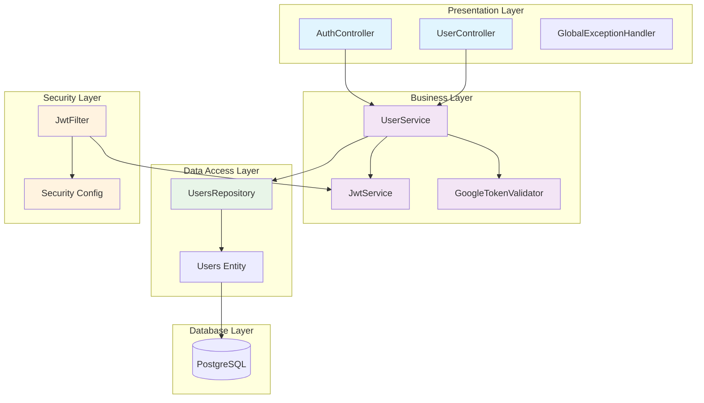
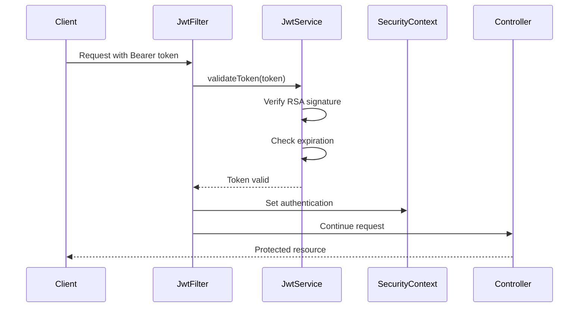
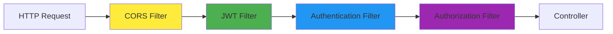
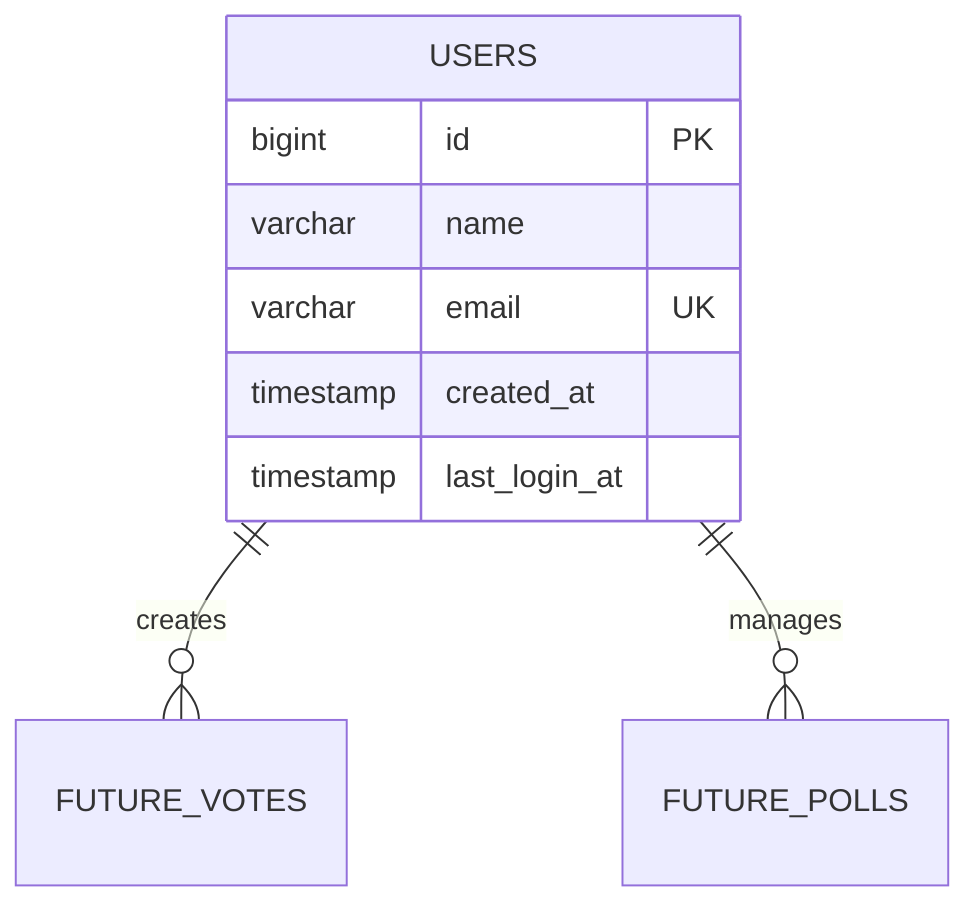
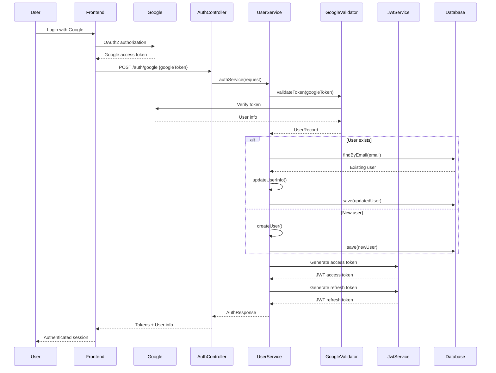

# 🏗️ VotingSystem Architecture

This document provides a comprehensive technical overview of the VotingSystem architecture, design patterns, and implementation details.

## Table of Contents

1. [System Overview](#system-overview)
2. [Layered Architecture](#layered-architecture)
3. [Project Structure](#project-structure)
4. [Security Architecture](#security-architecture)
5. [Database Schema](#database-schema)
6. [Authentication Flow](#authentication-flow)
7. [Component Details](#component-details)
8. [Design Patterns](#design-patterns)
9. [Configuration Management](#configuration-management)

## System Overview

The VotingSystem follows a **layered architecture pattern** with clear separation of concerns. Built on Spring Boot 3.x, it provides secure user authentication using Google OAuth2 integration with custom JWT token management.

### Core Principles

- **Security First**: RSA-signed JWT tokens with Google OAuth2 validation
- **Stateless Design**: No server-side session management
- **Clean Architecture**: Well-defined layers with dependency inversion
- **Exception Safety**: Comprehensive error handling and logging
- **Database Agnostic**: JPA abstraction with PostgreSQL implementation

## Layered Architecture



### Layer Responsibilities

#### 1. **Presentation Layer** (`Controller`)
- **Purpose**: Handle HTTP requests/responses and API contracts
- **Components**: `AuthController`, `UserController`
- **Responsibilities**:
  - Request validation and parameter binding
  - Response formatting and status code management
  - Exception handling coordination
  - API documentation compliance

#### 2. **Business Layer** (`Service`)
- **Purpose**: Implement business logic and orchestrate operations
- **Components**: `UserService`, `JwtService`, `GoogleTokenValidator`
- **Responsibilities**:
  - Authentication and authorization logic
  - User management operations
  - Token generation and validation
  - External service integration (Google OAuth2)

#### 3. **Data Access Layer** (`Repository`)
- **Purpose**: Abstract database operations and provide data persistence
- **Components**: `UsersRepository`, `Users` entity
- **Responsibilities**:
  - CRUD operations
  - Query optimization
  - Transaction management
  - Data mapping and transformation

#### 4. **Security Layer**
- **Purpose**: Handle authentication, authorization, and security policies
- **Components**: `JwtFilter`, `Security` configuration
- **Responsibilities**:
  - Request authentication
  - Security context management
  - CORS policy enforcement
  - Security headers and policies

## Project Structure

```
src/main/java/com/hancho/VotingSystem/
├── Application.java                    # 🚀 Application entry point
├── commons/                           # 📦 Shared components
│   ├── dtos/                         # 📋 Data Transfer Objects
│   │   ├── GoogleTokenInfo.java      # Google API response mapping
│   │   └── TokenClaims.java          # JWT token claims structure
│   └── exceptions/                   # ⚠️ Exception handling
│       └── GlobalExceptionHandler.java # Centralized error management
├── security/                         # 🔐 Security implementation
│   ├── GoogleTokenValidator.java     # Google token validation service
│   ├── JwtFilter.java               # JWT authentication filter
│   ├── JwtService.java              # JWT operations and management
│   └── Security.java                # Spring Security configuration
└── user/                            # 👤 User management domain
    ├── dtos/                        # User-specific DTOs
    │   ├── AuthResponse.java        # Authentication response model
    │   ├── GoogleAuthRequest.java   # Google auth request model
    │   └── UserRecord.java          # User data record
    ├── AuthController.java          # Authentication endpoints
    ├── UserController.java          # User management endpoints
    ├── UserInterface.java           # User service contract
    ├── UserService.java            # User business logic
    ├── Users.java                  # User JPA entity
    └── UsersRepository.java        # User data access
```

### Package Organization Principles

- **Domain-Driven Design**: Features organized by domain (`user`, `security`)
- **Layered Structure**: Clear separation between controllers, services, repositories
- **Shared Components**: Common utilities in `commons` package
- **Interface Segregation**: Specific interfaces for service contracts

## Security Architecture

### JWT Token Security Model



### RSA Key Pair Implementation

#### Key Generation Process
```bash
# 1. Generate private key
openssl genrsa -out private_key.pem 2048

# 2. Convert to PKCS#8 (Java compatible)
openssl pkcs8 -topk8 -inform PEM -outform PEM -nocrypt \
  -in private_key.pem -out private_key_pkcs8.pem

# 3. Generate public key
openssl rsa -in private_key.pem -pubout -out public_key.pem
```

#### Token Structure
```json
{
  "header": {
    "alg": "RS256",
    "typ": "JWT"
  },
  "payload": {
    "sub": "user@example.com",
    "email": "user@example.com",
    "name": "John Doe",
    "userId": 1,
    "type": "access-token",
    "iat": 1719849000,
    "exp": 1719852600
  },
  "signature": "RSA_SIGNATURE"
}
```

### Security Filters Chain



## Database Schema

### Users Table Schema

```sql
CREATE TABLE users (
    id BIGSERIAL PRIMARY KEY,
    name VARCHAR(255),
    email VARCHAR(255) NOT NULL UNIQUE,
    created_at TIMESTAMP DEFAULT CURRENT_TIMESTAMP,
    last_login_at TIMESTAMP
);

-- Indexes for performance
CREATE UNIQUE INDEX idx_users_email ON users(email);
CREATE INDEX idx_users_created_at ON users(created_at);
CREATE INDEX idx_users_last_login ON users(last_login_at);
```

### Entity Relationships



## Authentication Flow

### Complete OAuth2 + JWT Flow



### Token Lifecycle Management

| Token Type | Purpose | Expiry | Usage |
|------------|---------|--------|-------|
| **Access Token** | API authentication | 1 hour | Bearer token in headers |
| **Refresh Token** | Token renewal | 7 days | Refresh access tokens |

## Component Details

### JWT Service Architecture

```java
@Component
public class JwtService {
    // RSA key pair for signing/verification
    private PrivateKey privateKey;  // Signs tokens
    private PublicKey publicKey;    // Verifies tokens

    // Token expiry constants
    private final long ACCESS_EXPIRY = 3600;      // 1 hour
    private final long REFRESH_EXPIRY = 604800;   // 7 days
}
```

#### Key Methods:

- **`accessToken(TokenClaims)`**: Creates short-lived access tokens
- **`refreshToken(UserRecord)`**: Creates long-lived refresh tokens
- **`isTokenValid(String)`**: Validates token signature and expiry
- **`extractEmail(String)`**: Extracts user email from token claims

### User Service Business Logic

```java
@Service
public class UserService {
    // Core dependencies
    private final UsersRepository repository;
    private final GoogleTokenValidator validator;
    private final JwtService jwtService;

    // Main authentication workflow
    public AuthResponse authService(GoogleAuthRequest request) {
        // 1. Validate Google token
        // 2. Find or create user
        // 3. Generate JWT tokens
        // 4. Return authentication response
    }
}
```

### Security Configuration

```java
@Configuration
@EnableWebSecurity
public class Security {
    @Bean
    public SecurityFilterChain securityFilterChain(HttpSecurity http) {
        return http
            .sessionManagement(STATELESS)     // No sessions
            .csrf(DISABLED)                   // JWT-based auth
            .cors(CONFIGURED)                 // CORS policy
            .authorizeHttpRequests(           // Path-based security
                auth -> auth
                    .requestMatchers("/auth/**").permitAll()
                    .anyRequest().authenticated()
            )
            .addFilterBefore(jwtFilter, UsernamePasswordAuthenticationFilter.class)
            .build();
    }
}
```

## Design Patterns

### 1. **Repository Pattern**
- **Implementation**: `UsersRepository extends JpaRepository`
- **Benefits**: Data access abstraction, testability, query centralization
- **Usage**: `repository.findByEmail(email)`

### 2. **Service Layer Pattern**
- **Implementation**: `@Service` classes with business logic
- **Benefits**: Transaction management, business rule encapsulation
- **Usage**: Controller → Service → Repository

### 3. **DTO Pattern**
- **Implementation**: Record-based DTOs for data transfer
- **Benefits**: Type safety, immutability, clear contracts
- **Usage**: `AuthResponse`, `UserRecord`, `TokenClaims`

### 4. **Filter Chain Pattern**
- **Implementation**: Spring Security filter chain
- **Benefits**: Request processing pipeline, security layering
- **Usage**: JWT validation before authentication

### 5. **Dependency Injection**
- **Implementation**: Constructor injection throughout
- **Benefits**: Testability, loose coupling, IoC compliance
- **Usage**: `public UserService(UsersRepository repository, ...)`

## Configuration Management

### Application Properties (`application.yml`)

```yaml
spring:
  application:
    name: VotingSystem

  # Database configuration
  datasource:
    url: ${DB_URL}                    # Environment-based
    username: ${DB_USERNAME}
    password: ${DB_PASSWORD}
    driver-class-name: org.postgresql.Driver

  # JPA/Hibernate settings
  jpa:
    properties:
      hibernate:
        dialect: org.hibernate.dialect.PostgreSQLDialect
    show-sql: true                    # Development logging
    hibernate:
      ddl-auto: update                # Schema auto-management

# External service URLs
googleTokenInfoUrl: https://www.googleapis.com/oauth2/v1/tokeninfo
```

### Environment Variables

| Variable | Purpose | Example |
|----------|---------|---------|
| `DB_URL` | Database connection | `jdbc:postgresql://localhost:5432/voting_system` |
| `DB_USERNAME` | Database user | `voting_user` |
| `DB_PASSWORD` | Database password | `secure_password` |

### RSA Key Configuration

```java
@Component
public class JwtService {
    @Value("${jwt.private-key-path:classpath:keys/private_key.pem}")
    private Resource privateKeyResource;

    @Value("${jwt.public-key-path:classpath:keys/public_key.pem}")
    private Resource publicKeyResource;
}
```

## Performance Considerations

### Database Optimization

- **Connection Pooling**: HikariCP (Spring Boot default)
- **Index Strategy**: Email-based lookups optimized
- **Query Optimization**: JPA repository method queries
- **Transaction Management**: Service-level `@Transactional`

### Security Performance

- **Stateless Architecture**: No session storage overhead
- **RSA Verification**: Public key verification (faster than HMAC for read-heavy)
- **Token Caching**: Potential future enhancement
- **Filter Optimization**: Early JWT validation exit

### Memory Management

- **DTO Usage**: Immutable records reduce memory allocation
- **Connection Management**: Automatic connection lifecycle
- **Exception Handling**: Proper resource cleanup

## Monitoring & Observability

### Logging Strategy

```java
private static final Logger logger = LoggerFactory.getLogger(ClassName.class);

// Authentication events
logger.info("Authentication successful for user: {}", email);

// Error scenarios
logger.error("Google token validation error: {}", e.getMessage(), e);

// Debug information
logger.debug("Set authentication for user: {}", email);
```

### Metrics Collection

- **Actuator Endpoints**: Health checks and metrics
- **Database Metrics**: Connection pool monitoring
- **Authentication Metrics**: Success/failure rates
- **Performance Metrics**: Response times and throughput

## Security Best Practices

### Implementation Highlights

1. **Token Security**: RSA-256 signing with key rotation capability
2. **Input Validation**: Request validation at controller level
3. **Error Handling**: No sensitive information in error responses
4. **CORS Policy**: Configurable origin restrictions
5. **HTTPS Ready**: Production HTTPS enforcement capability
6. **Rate Limiting**: Future enhancement for API protection

### Production Considerations

- **Key Management**: Secure RSA key storage (not in version control)
- **Environment Separation**: Different keys per environment
- **Token Rotation**: Implement refresh token rotation
- **Audit Logging**: Security event tracking
- **Monitoring**: Authentication failure alerting

---

